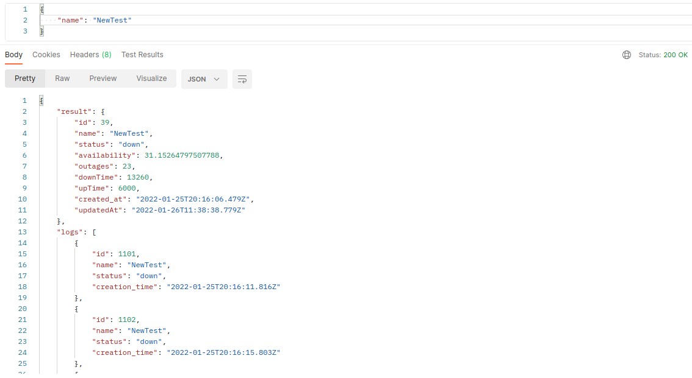

# URL Monitoring Service

A REST API to monitor the activity of some given URLs and store logs. Also, it notifies authorized users about their checks using both emails and ***Slack*** channels.

The API is built using **Node.js**, **Express** and **Typescript**, **PostgreSQL** and **Prisma** for the database, **Prettier** for linting and finally, **Swagger** for documenting and testing the endpoints.

---
### Usage

First, clone the repo locally on your machine, `cd monitor-api` to get started.

Install the needed dependencies `npm install` and wait for it to finish installing.

Then go add your envioronment variables in the .env file. You'll need to cd monitor-api/prisma to find the env file. 

Get back to the root folder, you'll need to apply Prisma's database migrations `npx prisma migrate dev`

You could run the app now and start playing around with it. Just `npm run dev`, head to http://localhost:3000/api-docs/ to go through the api endpoints and test them if you'd like.

---

### Testing Flow

1. The user registers first using email, username and password through `api/v1/auth/register`. A verification code is returned in the response.
   
2. The user then needs to verify his registration through `api/v1/auth/verify` in order to be able login. So he provides both his email and the verification code as was returned in the response from the `api/v1/auth/register` request. A message with success will be returned in case of a successful verification.
   
3. Lastly, the user could now login through `api/v1/auth/login` so that he could obtain his access token in order to authorize his account. As soon as you get the response with it, copy the access token and save it somewhere safe. Click on the upper right **Authorize** button. Paste the token you just saved in the text field. Make sure you type *Bearer* before the token, separated from the token by a white space and then press **Authorize**.

4. Now you can start testing the checks endpoints.

---
##### N.B.

1. Swagger doesn't let you add use a request body in a GET request so here's a pic of it from Postman.

2. Provide your own *Slack Webhook* link to test the notifications.
3. For the email notifications, you need to make sure to generate an **App Password** (Use your own email password if it doesn't work) as your email password, [disable captcha service](https://accounts.google.com/b/0/DisplayUnlockCaptcha), 2FA and enable permissions for [less secure apps](https://www.google.com/settings/security/lesssecureapps) in *Gmail*. 

---
### Future Plans

Currently there are some issues in Primsa with parsing the database url inside the docker host since I found multiple "Open" issues on their repo from other developers who faced the same problem.